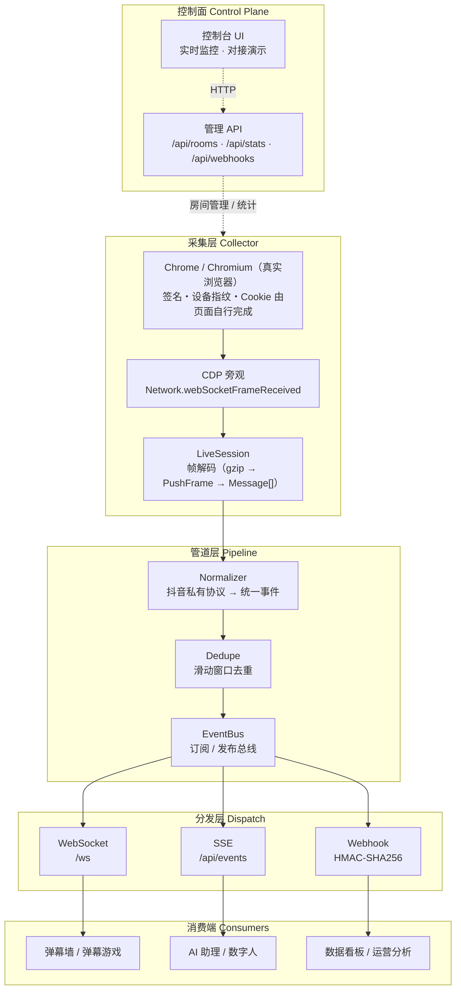
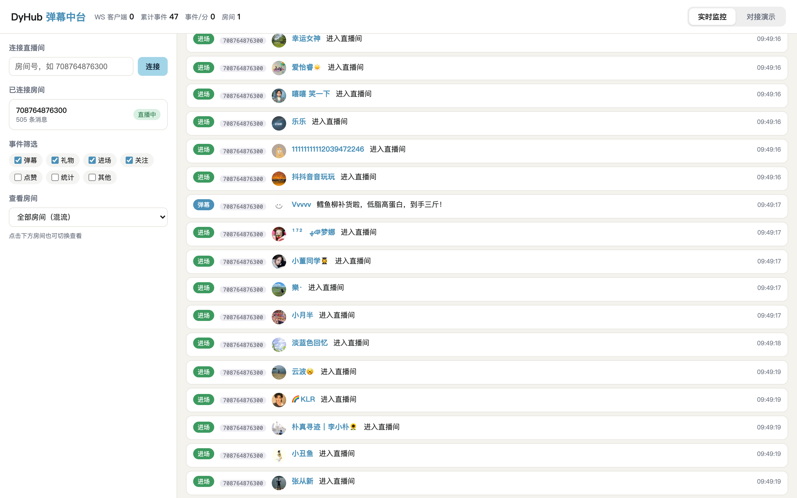
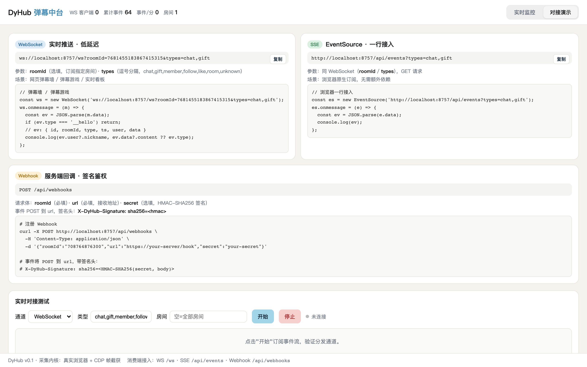

# DyHub・抖音直播弹幕中台基座

> 自研采集内核・事件全链路标准化・消费端与抖音私有协议完全解耦

DyHub 是一个抖音直播弹幕采集与分发中台：**采集内核自研**（真实浏览器 + CDP 帧截获），产出**统一事件协议**（`DanmakuEvent`），并通过 **WebSocket / SSE / Webhook** 三种通道分发。上游改协议不碰消费端，下游接弹幕墙、弹幕游戏、AI 助理、数据看板只认一种事件。





***

## ✨ 特性


* **零逆向采集内核**：真实浏览器（系统 Chrome headless）自行完成签名、设备指纹、Cookie；采集侧只通过 CDP 旁观 WebSocket 帧，**抖音改协议页面自动跟随**

* **统一事件协议**：抖音私有 protobuf → 标准化 `DanmakuEvent`，消费端零感知

* **三通道分发**：WebSocket（低延迟实时）、SSE（浏览器一行接入）、Webhook（HMAC-SHA256 签名鉴权）

* **多房间并发**：单浏览器实例多页面，支持同时采集多个直播间，控制台一键切换查看

* **可视化控制台**：实时弹幕流（头像 / 事件类型 / 来源房间）、事件筛选、房间管理、对接演示与在线测试

* **可插拔扩展**：新增平台只需写一个 collector 适配器，复用同一套事件协议与分发层


***

## 🖼️ 界面预览

**实时监控**：多房间同时采集，事件流实时展示（头像 / 事件类型 / 来源房间 / 昵称），支持按房间切换查看与事件类型筛选。



**对接演示**：WS / SSE / Webhook 三种通道的接入地址、参数与代码示例，底部可在线测试分发通道。




***

## 🧠 采集原理：为什么用真实浏览器 + CDP

Spike 阶段实测：抖音对无头 HTTP 客户端（Node fetch + 手工签名 + 简易 Cookie）直接返回 `DEVICE_BLOCKED`（HTTP 415）风控，SDK 直连方案在当前环境已失效。因此本方案：


1. 启动系统 Chrome（headless=new）打开直播间页面，页面自行完成签名 / 指纹 / Cookie

2. 通过 CDP `Network.webSocketFrameReceived` **旁观**弹幕 WebSocket 帧数据，不改写页面逻辑

3. 帧经 `gzip 解压 → PushFrame → Response → Message[]` 解码为原始消息

4. 按 method 匹配 ChatMessage / GiftMessage / MemberMessage 等，标准化为统一事件

> 无头模式需一次点击手势触发播放器初始化，弹幕 wss 才会建立（已自动处理）。


***

## 🚀 快速开始

### 前置要求


* **Node.js ≥ 20**

* **Chrome / Chromium**（macOS、Windows 直接装 Chrome；Linux 见[跨平台部署](#-跨平台部署)）

### 安装与运行


```
npm install

npm run build && npm start   # 生产模式（或 npm run dev 开发模式）
```

### 连接直播间


```
\# 打开控制台

open http://localhost:8757

\# 连接直播间（示例：东方甄选）

curl -X POST http://localhost:8757/api/rooms/connect \\

&#x20; -H 'Content-Type: application/json' \\

&#x20; -d '{"roomId":"708764876300"}'
```

控制台左侧可连接多个房间，通过 "查看房间" 下拉在**全部房间混流**与**单房间**之间切换；事件行展示头像、事件类型、来源房间与昵称。

### 环境变量


| 变量             | 说明                      | 默认        |
| -------------- | ----------------------- | --------- |
| `DYHUB_PORT`   | 管理端口                    | `8757`    |
| `DYHUB_HOST`   | 监听地址                    | `0.0.0.0` |
| `DYHUB_CHROME` | Chrome/Chromium 可执行文件路径 | 自动探测      |
| `DYHUB_HEADED` | 设为 `1` 打开有头浏览器（调试用）     | 无（默认无头）   |


***

## 📦 事件协议

所有消费端只看到统一事件，不感知抖音 protobuf：


```
{

&#x20; "id": "7681626144000791846",

&#x20; "roomId": "708764876300",

&#x20; "platform": "douyin",

&#x20; "type": "chat",

&#x20; "ts": 1788517960528,

&#x20; "receivedAt": 1788517960528,

&#x20; "user": {

&#x20;   "id": "101652211600",

&#x20;   "nickname": "田💕心",

&#x20;   "avatar": "https://p3.douyinpic.com/aweme/100x100/...",

&#x20;   "secUid": "MS4wLjAB..."

&#x20; },

&#x20; "data": { "content": "劲道牛肉丸，3袋立享88折！" }

}
```

> `roomId`
>
>  统一为用户连接的房间号（web_rid），与房间管理 / 订阅过滤一致。

**事件类型**：


| type      | 含义      | data 关键字段                                                  |
| --------- | ------- | ---------------------------------------------------------- |
| `chat`    | 弹幕      | `content`                                                  |
| `gift`    | 礼物      | `giftName` / `diamondCount` / `repeatCount` / `comboCount` |
| `member`  | 进场      | `memberCount`                                              |
| `like`    | 点赞      | `count` / `total`                                          |
| `follow`  | 关注      | `action`                                                   |
| `room`    | 直播间统计   | `total`（在线）/ `popularity` / `totalUser`                    |
| `unknown` | 未识别消息透传 | `method`                                                   |


***

## 🔌 消费端接入

### WebSocket（网页弹幕墙 / 弹幕游戏）


```
const ws = new WebSocket('ws://localhost:8757/ws?roomId=708764876300\&types=chat,gift,member');

ws.onmessage = (m) => {

&#x20; const ev = JSON.parse(m.data);

&#x20; if (ev.type === '\_\_hello') return; // 握手消息

&#x20; console.log(ev.user?.nickname, ev.data?.content ?? ev.type);

};
```

### SSE（浏览器一行接入）


```
const es = new EventSource('http://localhost:8757/api/events?types=chat,gift');

es.onmessage = (e) => {

&#x20; const ev = JSON.parse(e.data);

&#x20; console.log(ev);

};
```

### Webhook（服务端消费，HMAC 签名）


```
curl -X POST http://localhost:8757/api/webhooks \\

&#x20; -H 'Content-Type: application/json' \\

&#x20; -d '{"roomId":"708764876300","url":"https://your-server/hook","secret":"your-secret"}'

\# 事件将 POST 到 url，带签名头：

\# X-DyHub-Signature: sha256=\<HMAC-SHA256(secret, body)>
```

**通用参数**（WS / SSE）：`roomId`（选填，订阅指定房间，缺省全部）、`types`（选填，逗号分隔的事件类型过滤）。


***

## 📡 API 参考


| 方法              | 路径                                       | 说明                       |
| --------------- | ---------------------------------------- | ------------------------ |
| GET             | `/`                                      | 控制台（实时监控 + 多房间切换 + 对接演示） |
| GET             | `/api/rooms`                             | 已连接直播间列表                 |
| POST            | `/api/rooms/connect`                     | 连接直播间 `{roomId}`         |
| POST            | `/api/rooms/:roomId/disconnect`          | 断开直播间                    |
| GET             | `/api/rooms/:roomId`                     | 单房间详情                    |
| GET             | `/api/stats`                             | 全局统计（WS 客户端数 / 房间 / 事件量） |
| GET             | `/api/events?types=chat,gift&roomId=xxx` | SSE 实时事件流                |
| GET/POST/DELETE | `/api/webhooks`                          | Webhook 订阅管理             |


***

## 🗂️ 项目结构


```
src/

├── index.ts                 # 入口：装配采集 → 管道 → 分发 → API

├── types/events.ts          # 标准化事件协议（消费端唯一依赖）

├── proto/douyin.proto.ts    # protobuf 解码器（帧/消息体）

├── collector/

│   ├── browser.ts           # 浏览器管理（Chrome 探测 / 页面 / CDP）

│   ├── liveSession.ts       # 单直播间会话（帧监听 / 状态机）

│   └── collector.ts         # 采集器门面（多房间管理）

├── pipeline/

│   ├── normalizer.ts        # 抖音私有协议 → 统一事件（翻译层）

│   ├── dedupe.ts            # 滑动窗口去重

│   └── eventBus.ts          # 事件总线（订阅 / 发布，解耦核心）

├── dispatch/

│   ├── wsServer.ts          # WebSocket 实时推送

│   ├── sseServer.ts         # SSE 推送

│   └── webhook.ts           # Webhook 投递（HMAC 签名）

├── api/server.ts            # Fastify 管理 API

└── ui/dashboard.html        # 控制台单页应用
```


***

## 🖥️ 跨平台部署

项目为纯 Node.js 实现，无平台绑定原生模块，**macOS / Linux / Windows 均可运行**，唯一平台相关点是浏览器路径探测（已内置三平台常见路径，也可用 `DYHUB_CHROME` 指定）。

### Linux（Ubuntu/Debian 示例）


```
sudo apt install -y chromium-browser

npm install && npm run build

DYHUB\_CHROME=/usr/bin/chromium nohup node dist/index.js > dyhub.log 2>&1 &
```

建议用 systemd 常驻：`Restart=always` + `WorkingDirectory` 指向项目目录。


***

## 🧩 扩展点 / Roadmap


* **规则引擎**：事件总线 + `type + user + content` 规则匹配 → 触发动作

* **AI 助理**：消费 `chat` 事件喂给 LLM，回复经 OBS / 弹幕回发

* **弹幕游戏**：`member` / `chat` 事件驱动游戏状态机

* **数据看板**：`room` 事件做在线趋势、`gift` 做营收统计

* **多平台**：新增 `collector/bilibili.ts` 等适配器，复用同一事件协议

欢迎提 Issue / PR。


***

## ❓ 常见问题

**Q：**`npm run build`**&#x20;报&#x20;**`Unable to resolve @typescript/typescript-darwin-x64`

TypeScript 7 使用原生平台包，npm 按安装时的 Node 架构选择（arm64 /x64）。若运行 `tsc` 的 Node 与安装依赖时的架构不一致，会缺对应平台包。修复：


```
npm install -f @typescript/typescript-darwin-x64   # 或 -arm64，按实际报错

\# 更推荐：统一 Node 版本后重新 npm install
```

**Q：连接后房间一直&#x20;**`connecting`**（0 帧）**

多为首次启动采集浏览器较慢（页面加载 + 播放器初始化），等待 10\~30 秒；若持续不进入 `live`，检查直播间是否在直播、以及 `DYHUB_CHROME` 指向的浏览器版本。

**Q：会被抖音风控吗？**

方案为 "真实浏览器被动旁观"，不发送业务请求，风险显著低于纯 HTTP 逆向。但仍请遵守平台规则、控制采集规模，仅采集自有或已授权直播间。


***

## ⚠️ 合规声明


* 仅采集**自有或已获授权**的直播间；请遵守抖音平台规则与相关法律法规

* 采集为被动旁观（不发送业务请求），请控制并发、合理使用

* 抖音接口可能随时调整，本方案因浏览器自动跟随而具备较强韧性

## 📄 License

[MIT](./LICENSE)

## 🙏 致谢

设计思路参考了以下优秀开源项目：


* [skmcj/dycast](https://github.com/skmcj/dycast) —— 抖音直播弹幕姬

* [saermart/DouyinLiveWebFetcher](https://github.com/saermart/DouyinLiveWebFetcher) —— 抖音 Live 弹幕采集（AGPL-3.0）